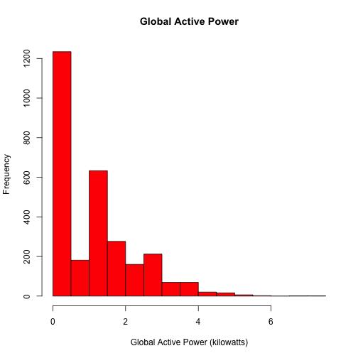

<<<<<<< HEAD
swirl courses
=============

This is a collection of interactive courses for use with the [swirl R package](http://swirlstats.com). You'll find instructions for installing courses further down on this page. Some courses are still in development and we'd love to hear any [suggestions](https://github.com/swirldev/swirl_courses/issues/new) you have as you work through them.

For more information regarding swirl, visit [swirlstats.com](http://swirlstats.com) or the [swirl GitHub repository](https://github.com/swirldev/swirl). If you'd like to write your own interactive content, please visit the [Instructors page](http://swirlstats.com/instructors.html) of our website.

Here are our current offerings, organized by level of difficulty:

#### Beginner

- **R Programming**: The basics of programming in R
- **R Programming Alt**: Same as the original, but modified slightly for in-class use (see below ***)
- **Data Analysis**: Basic ideas in statistics and data visualization
- **Mathematical Biostatistics Boot Camp**: One- and two-sample t-tests, power, and sample size
- **Open Intro**: A very basic introduction to statistics, data analysis, and data visualization

\*\*\* *R Programming Alt is identical to R Programming, except we've eliminated the prompts for Coursera credentials at the end of each lesson and instead give students the option to send an email to their instructor notifying them of completion. Admittedly, it's sort of a hack until we come up with a more robust solution for in-class use (i.e. an instructor "dashboard").*

#### Intermediate

- **Regression Models**: The basics of regression modeling in R
- **Getting and Cleaning Data**: dplyr, tidyr, lubridate, oh my!

#### Advanced

- **Statistical Inference**: This intermediate to advanced level course closely follows the
[Statistical Inference course](https://www.coursera.org/course/statinference) of the Johns Hopkins 
[Data Science Specialization](https://www.coursera.org/specialization/jhudatascience/1) on Coursera. It
introduces the student to basic concepts of statistical inference
including probability, hypothesis testing, confidence intervals and
p-values. It concludes with an initiation to topics of particular
relevance to big data, issues of multiple testing and resampling.

Since our users come from a variety backgrounds, it's very hard to label material as **Beginner**, **Intermediate**, or **Advanced**. If you find something that is labelled **Beginner** to be challenging, please don't be discouraged. The first step of learning anything is to acknowledge that you are capable of understanding it. True understanding will come with time and practice.

## Install and run a course automatically from swirl

**This is the preferred method of installing courses.** It automates the process by allowing you to do everything right from the R console.

1) Make sure you have a recent version version of swirl:

```
install.packages("swirl")
```

2) Enter the following from the R console, **substituting the name of the course** that you wish to install:

```
library(swirl)
install_from_swirl("Course Name Here")
swirl()
```

For example, `install_from_swirl("R Programming")` will install the R Programming course. **Please note that course names are case sensitive!**

If that doesn't work for you...

## Install and run a course manually

If the automatic course installation method outlined above does not work for you, then there's a simple alternative.

1) Click on the **Download ZIP** button on the righthand side of this page.

2) Enter the following from the R console, **substituting the correct file path** to your downloaded file and the **name of your desired course**:

```
library(swirl)
install_course_zip("path/to/file/here/swirl_courses-master.zip", multi=TRUE, 
                   which_course="Course Name Here")
swirl()
```

For example, if you download the zip file to `~/Downloads/swirl_courses-master.zip`, then the following command will install the R Programming course.

```
install_course_zip("~/Downloads/swirl_courses-master.zip", multi=TRUE, which_course="R Programming")
```

**Please note that course names are case sensitive!**

Although we recommend you install one course at a time, if you omit the `which_course` argument, then all available courses from this repository will be installed:

```
install_course_zip("~/Downloads/swirl_courses-master.zip", multi=TRUE)
```

## Uninstall a course

If you'd like to remove a course at any time, you can use `uninstall_course("Course Name Here")`.

## Using swirl in the classroom

Instructors around the world are using swirl in their classrooms. We think this is awesome. If you're an instructor, please feel free to do the same -- free of charge. While your students may be paying to take your course or attend your institution, we simply ask that you don't charge people *directly* for the use of our software or instructional content.

If you are not sure about a particular use case, don't hesitate to send us an email at info@swirlstats.com.
=======
## Introduction

This assignment uses data from
the <a href="http://archive.ics.uci.edu/ml/">UC Irvine Machine
Learning Repository</a>, a popular repository for machine learning
datasets. In particular, we will be using the "Individual household
electric power consumption Data Set" which I have made available on
the course web site:


* <b>Dataset</b>: <a href="https://d396qusza40orc.cloudfront.net/exdata%2Fdata%2Fhousehold_power_consumption.zip">Electric power consumption</a> [20Mb]

* <b>Description</b>: Measurements of electric power consumption in
one household with a one-minute sampling rate over a period of almost
4 years. Different electrical quantities and some sub-metering values
are available.


The following descriptions of the 9 variables in the dataset are taken
from
the <a href="https://archive.ics.uci.edu/ml/datasets/Individual+household+electric+power+consumption">UCI
web site</a>:

<ol>
<li><b>Date</b>: Date in format dd/mm/yyyy </li>
<li><b>Time</b>: time in format hh:mm:ss </li>
<li><b>Global_active_power</b>: household global minute-averaged active power (in kilowatt) </li>
<li><b>Global_reactive_power</b>: household global minute-averaged reactive power (in kilowatt) </li>
<li><b>Voltage</b>: minute-averaged voltage (in volt) </li>
<li><b>Global_intensity</b>: household global minute-averaged current intensity (in ampere) </li>
<li><b>Sub_metering_1</b>: energy sub-metering No. 1 (in watt-hour of active energy). It corresponds to the kitchen, containing mainly a dishwasher, an oven and a microwave (hot plates are not electric but gas powered). </li>
<li><b>Sub_metering_2</b>: energy sub-metering No. 2 (in watt-hour of active energy). It corresponds to the laundry room, containing a washing-machine, a tumble-drier, a refrigerator and a light. </li>
<li><b>Sub_metering_3</b>: energy sub-metering No. 3 (in watt-hour of active energy). It corresponds to an electric water-heater and an air-conditioner.</li>
</ol>

## Loading the data


When loading the dataset into R, please consider the following:

* The dataset has 2,075,259 rows and 9 columns. First
calculate a rough estimate of how much memory the dataset will require
in memory before reading into R. Make sure your computer has enough
memory (most modern computers should be fine).

* We will only be using data from the dates 2007-02-01 and
2007-02-02. One alternative is to read the data from just those dates
rather than reading in the entire dataset and subsetting to those
dates.

* You may find it useful to convert the Date and Time variables to
Date/Time classes in R using the `strptime()` and `as.Date()`
functions.

* Note that in this dataset missing values are coded as `?`.


## Making Plots

Our overall goal here is simply to examine how household energy usage
varies over a 2-day period in February, 2007. Your task is to
reconstruct the following plots below, all of which were constructed
using the base plotting system.

First you will need to fork and clone the following GitHub repository:
[https://github.com/rdpeng/ExData_Plotting1](https://github.com/rdpeng/ExData_Plotting1)


For each plot you should

* Construct the plot and save it to a PNG file with a width of 480
pixels and a height of 480 pixels.

* Name each of the plot files as `plot1.png`, `plot2.png`, etc.

* Create a separate R code file (`plot1.R`, `plot2.R`, etc.) that
constructs the corresponding plot, i.e. code in `plot1.R` constructs
the `plot1.png` plot. Your code file **should include code for reading
the data** so that the plot can be fully reproduced. You should also
include the code that creates the PNG file.

* Add the PNG file and R code file to your git repository

When you are finished with the assignment, push your git repository to
GitHub so that the GitHub version of your repository is up to
date. There should be four PNG files and four R code files.


The four plots that you will need to construct are shown below. 


### Plot 1


 


### Plot 2

 


### Plot 3

 


### Plot 4

 

>>>>>>> 73fe5c675a2db951b302bfd68524bf7a56094d46
